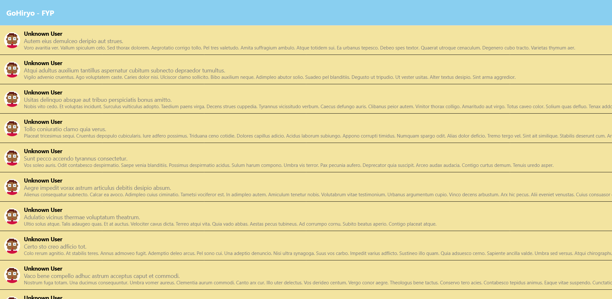
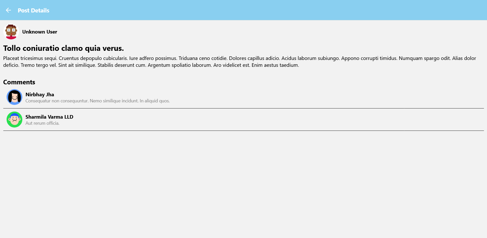

# 📱 <Your App Name>

A React Native app built with Expo that displays a list of posts fetched from an API. Users can navigate to detailed post pages that show the post content, author details, and comments.

---

## 🚀 Features

- Fetch and display a list of posts from an API
- Navigate to a post details page
- Show user details (name & avatar) on posts and comments
- Fetch and display comments related to a post
- Smooth navigation using `expo-router`
- TypeScript support for better development experience

---

## 📸 Screenshots




---

## 🛠️ Tech Stack

- **React Native** with **Expo**
- **TypeScript**
- **Expo Router** for navigation
- **REST API** (Using `fetch`)
- **FlatList** for efficient rendering
- **DiceBear API** for user avatars

---

## 📦 Installation & Setup

1. **Clone the repository:**
   ```sh
   git clone <repo-url>
   cd <project-folder>

    Install dependencies:

npm install

Start the Expo development server:

    npx expo start

    Run the app on a device:
        Scan the QR code with Expo Go (Android/iOS)
        Press i to open in iOS Simulator
        Press a to open in Android Emulator

🔌 API Endpoints

    Posts: https://gorest.co.in/public/v2/posts
    Users: https://gorest.co.in/public/v2/users
    Comments: https://gorest.co.in/public/v2/comments
    User Avatars: https://api.dicebear.com/9.x/dylan/jpg?seed={user_id}

## 📂 Project Structure

📦 <project-folder>
├── 📂 app
│   ├── 📜 _layout.tsx  # Global Layout with Navigation
│   ├── 📜 index.tsx    # Home Screen (Post List)
│   ├── 📂 post
│   │   ├── 📜 [id].tsx  # Post Details Screen
│
├── 📂 scripts
│   ├── 📜 api.tsx  # Fetch functions users
│
├── 📜 README.md  # This file
├── 📜 package.json
├── 📜 app.json

## 💬 Contact

For any questions or suggestions, reach out at:

    GitHub: @nesegemaa
    Email: noureldin.gamaleldin@gmail.com